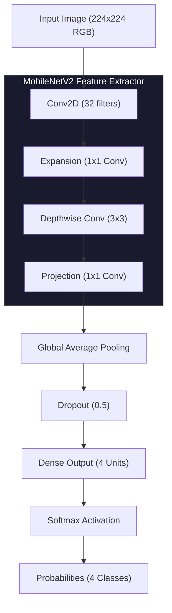

<div align="center">

<br/>


<br/>

<p align="center">
  
  &nbsp;
  
  &nbsp;
  
  &nbsp;
  
  &nbsp;
  
</p>

<p align="center">
  AI-powered brain tumor classification from MRI scans<br/>
  using MobileNetV2, Grad-CAM, and CLIP validation
</p>

<p align="center">
  <a href="https://neuro-scan-brain-tumor-classification.vercel.app">
    
  </a>
  &nbsp;
  <a href="https://yashnaiduu-neurosacn.hf.space">
    
  </a>
  &nbsp;
  <a href="https://huggingface.co/datasets/Sartajbhuvaji/Brain-Tumor-Classification-MRI">
    
  </a>
</p>

<br/>

</div>

---

<div align="center">
  
</div>

<br/>

---

## Overview

NeuroScan is a full-stack medical imaging web application that classifies brain MRI scans into four categories using a fine-tuned **MobileNetV2** deep learning model. It features real-time Grad-CAM heatmap visualization and CLIP-based MRI validation, deployed on Hugging Face Spaces (backend) and Vercel (frontend).

<br/>

---

## Features

<div align="center">

| Feature | Description |
|:---:|:---|
| **4-Class Classification** | Glioma · Meningioma · Pituitary · No Tumor |
| **Grad-CAM Heatmaps** | Visual explanation of which brain regions influenced the prediction |
| **CLIP MRI Validation** | Rejects non-MRI images before classification using OpenAI CLIP |
| **Random Sample Testing** | Try the model with real MRI samples from the bundled dataset |
| **Confidence Scores** | Per-class probability breakdown for every prediction |
| **Responsive UI** | Dark mode interface with smooth animations |

</div>

<br/>

---

## System Architecture



<div align="center">

| Layer | Details |
|:---|:---|
| Base Model | MobileNetV2 (pre-trained on ImageNet) |
| Input | 224 × 224 RGB |
| Feature Extraction | Depthwise separable convolutions |
| Pooling | Global Average Pooling |
| Regularization | Dropout (0.5) |
| Output | Dense (4 units) + Softmax |

**Accuracy: 96.8% on test set &nbsp;·&nbsp; Inference: < 2s on CPU**

</div>

<br/>

---

## API Endpoints

<div align="center">

| Endpoint | Method | Description |
|:---|:---:|:---|
| `/` | `GET` | API info |
| `/health` | `GET` | Health check |
| `/stats` | `GET` | Model and system stats |
| `/predict` | `POST` | Classify uploaded MRI |
| `/heatmap` | `POST` | Generate Grad-CAM heatmap |
| `/random` | `GET` | Classify a random sample MRI |

</div>

<br/>

---

## Tech Stack

<div align="center">

**Backend** &nbsp;·&nbsp; Python 3.9+ &nbsp;·&nbsp; Flask &nbsp;·&nbsp; TensorFlow / Keras &nbsp;·&nbsp; OpenCV &nbsp;·&nbsp; CLIP (Transformers + PyTorch) &nbsp;·&nbsp; Hugging Face Spaces (Docker)

**Frontend** &nbsp;·&nbsp; HTML5 &nbsp;·&nbsp; CSS3 &nbsp;·&nbsp; Vanilla JavaScript &nbsp;·&nbsp; Vercel

</div>

<br/>

---

## Dataset

Uses the [Brain Tumor Classification (MRI)](https://huggingface.co/datasets/Sartajbhuvaji/Brain-Tumor-Classification-MRI) dataset.

<div align="center">

| Class | Description |
|:---|:---|
| Glioma | Primary brain tumors from glial cells |
| Meningioma | Tumors arising from the meninges |
| Pituitary | Tumors affecting the pituitary gland |
| No Tumor | Healthy brain scans |

</div>

<br/>

---

## Local Development

```bash
# Clone the repository
git clone https://github.com/yashnaiduu/NeuroScan-Brain-Tumor-Classification.git
cd NeuroScan-Brain-Tumor-Classification

# Create and activate virtual environment
python -m venv venv
source venv/bin/activate        # Windows: venv\Scripts\activate

# Install dependencies
pip install -r requirements.txt

# Run backend
python server1.py               # http://localhost:5050

# Run frontend (separate terminal)
cd client && python3 -m http.server 8000   # http://localhost:8000
```

<br/>

**Environment Variables**

| Variable | Required | Description |
|:---|:---:|:---|
| `PORT` | Optional | Backend port (default: 5050, HF Spaces: 7860) |

<br/>

---

## Deployment

<div align="center">

| Platform | Purpose | Config |
|:---|:---|:---|
| Hugging Face Spaces | Backend API | `Dockerfile`, `entrypoint.sh` |
| Vercel | Frontend | `vercel.json` |

</div>

See [DEPLOYMENT.md](DEPLOYMENT.md) for detailed instructions.

<br/>

---

## License

MIT License — see [LICENSE](LICENSE) for details.

<br/>

---

<div align="center">

**Yash Naidu**

<a href="mailto:yashnnaidu@gmail.com">
  
</a>

<br/><br/>

<sub>Built with TensorFlow · Deployed on Hugging Face & Vercel</sub>

</div>
