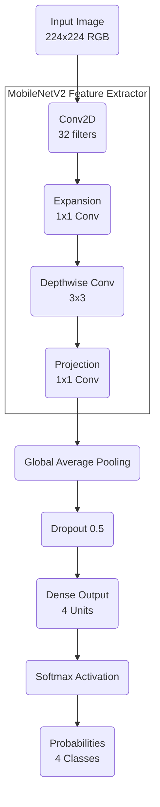

# NeuroScan — Brain Tumor Classification

<div align="center">


AI-powered brain tumor classification from MRI scans using MobileNetV2 and Grad-CAM.

[Live Demo](https://neuro-scan-brain-tumor-classification.vercel.app) · [Backend API](https://yashnaiduu-neurosacn.hf.space) · [Dataset](https://huggingface.co/datasets/Sartajbhuvaji/Brain-Tumor-Classification-MRI)

</div>

---

## Preview

<div align="center">
  
</div>

---

## Overview

NeuroScan is a full-stack medical imaging web application that classifies brain MRI scans into four categories using a fine-tuned MobileNetV2 deep learning model. It features real-time Grad-CAM heatmap visualization and CLIP-based MRI validation.

## Live Deployment

| Service | URL |
|---------|-----|
| Frontend | [neuro-scan-brain-tumor-classification.vercel.app](https://neuro-scan-brain-tumor-classification.vercel.app) |
| Backend API | [yashnaiduu-neurosacn.hf.space](https://yashnaiduu-neurosacn.hf.space) |

## Features

- **4-Class Tumor Classification** — Glioma, Meningioma, Pituitary, No Tumor
- **Grad-CAM Heatmaps** — Visual explanation of which brain regions influenced the prediction
- **CLIP MRI Validation** — Rejects non-MRI images before classification using OpenAI CLIP
- **Random Sample Testing** — Try the model with real MRI samples from the bundled dataset
- **Confidence Scores** — Per-class probability breakdown for every prediction
- **Responsive UI** — Dark mode interface with smooth animations

## System Architecture



| Layer | Details |
|-------|---------|
| Base Model | MobileNetV2 (pre-trained on ImageNet) |
| Input | 224×224 RGB |
| Feature Extraction | Depthwise separable convolutions |
| Pooling | Global Average Pooling |
| Regularization | Dropout (0.5) |
| Output | Dense (4 units) + Softmax |

- **Accuracy**: 96.8% on test set
- **Inference time**: <2s on CPU

## API Endpoints

| Endpoint | Method | Description |
|----------|--------|-------------|
| `/` | GET | API info |
| `/health` | GET | Health check |
| `/stats` | GET | Model and system stats |
| `/predict` | POST | Classify uploaded MRI |
| `/heatmap` | POST | Generate Grad-CAM heatmap |
| `/random` | GET | Classify a random sample MRI |

## Tech Stack

**Backend**
- Python 3.9+, Flask, Flask-CORS
- TensorFlow / Keras (MobileNetV2)
- OpenCV (image processing)
- Transformers + PyTorch (CLIP validation)
- Deployed on Hugging Face Spaces (Docker)

**Frontend**
- HTML5, CSS3, Vanilla JavaScript
- Deployed on Vercel

## Dataset

Uses the [Brain Tumor Classification (MRI)](https://huggingface.co/datasets/Sartajbhuvaji/Brain-Tumor-Classification-MRI) dataset with 4 classes:

| Class | Description |
|-------|-------------|
| Glioma | Primary brain tumors from glial cells |
| Meningioma | Tumors arising from the meninges |
| Pituitary | Tumors affecting the pituitary gland |
| No Tumor | Healthy brain scans |

## Local Development

### Prerequisites
- Python 3.9+
- Git

### Setup

```bash
# Clone the repository
git clone https://github.com/yashnaiduu/NeuroScan-Brain-Tumor-Classification.git
cd NeuroScan-Brain-Tumor-Classification

# Create virtual environment
python -m venv venv
source venv/bin/activate  # Windows: venv\Scripts\activate

# Install dependencies
pip install -r requirements.txt

# Run backend
python server1.py
# Backend runs at http://localhost:5050

# Run frontend (separate terminal)
cd client && python3 -m http.server 8000
# Frontend at http://localhost:8000
```

### Environment Variables

| Variable | Required | Description |
|----------|----------|-------------|
| `PORT` | Optional | Backend port (default: 5050, HF Spaces: 7860) |

## Deployment

| Platform | Purpose | Config |
|----------|---------|--------|
| Hugging Face Spaces | Backend API | `Dockerfile`, `entrypoint.sh` |
| Vercel | Frontend | `vercel.json` |

See [DEPLOYMENT.md](DEPLOYMENT.md) for detailed instructions.

## License

MIT License — see [LICENSE](LICENSE) for details.

## Author

**Yash Naidu**
[yashnnaidu@gmail.com](mailto:yashnnaidu@gmail.com)
