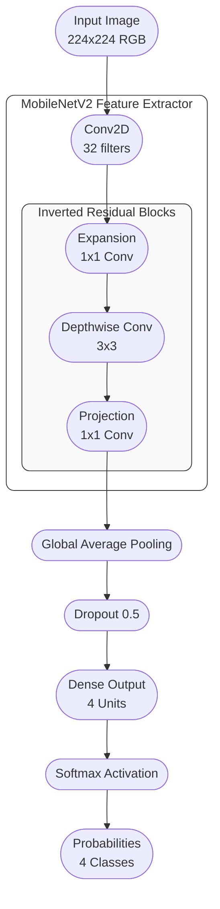

# NeuroScan - Brain Tumor Classification

NeuroScan is a deep learning-based application for classifying brain tumors from MRI scans. It utilizes a fine-tuned MobileNetV2 architecture with transfer learning to detect and classify Gliomas, Meningiomas, Pituitary tumors, and normal brain scans with high confidence.

## Preview


## Features

- **Multi-Class Classification**: Identifies Glioma, Meningioma, Pituitary, and No Tumor cases
- **Deep Learning Model**: Powered by a custom-trained MobileNetV2 neural network
- **Validation System**: Integrates Google Gemini Vision API to verify if uploaded images are valid brain MRI scans
- **Grad-CAM Visualization**: Generates heatmaps to highlight brain regions influencing the AI's decision
- **Performance Analytics**: Real-time confidence scores and detailed probability analysis
- **Modern Interface**: Responsive web interface with dark mode and smooth transitions

## System Architecture



- **Base Model**: MobileNetV2 (pre-trained on ImageNet)
- **Input Layer**: Accepts 224x224 RGB images
- **Feature Extraction**: Depthwise separable convolutions to extract high-level features
- **Global Average Pooling**: Reduces spatial dimensions
- **Dropout Layer**: Rate of 0.5 to prevent overfitting
- **Output Layer**: Dense layer with Softmax activation for 4-class probability distribution

This architecture ensures rapid inference times (<2s on CPU) while maintaining high accuracy (96.8% on test set).

## Dataset

This project uses the **Brain Tumor Classification (MRI)** dataset. The model has been trained on a comprehensive collection of MRI scans categorized into four classes:

- **Glioma**: Primary brain tumors
- **Meningioma**: Tumors arising from the meninges
- **Pituitary**: Tumors affecting the pituitary gland
- **No Tumor**: Healthy brain scans

The dataset is organized into training and testing sets to ensure robust model evaluation.

## Technology Stack

- **Backend**: Python, Flask
- **Machine Learning**: TensorFlow, Keras, OpenCV, NumPy
- **Frontend**: HTML5, CSS3, JavaScript
- **API**: Google Gemini Vision API (for validation)
- **Deployment**: Docker support included

## Installation

### Prerequisites

- Python 3.9 or higher
- Git

### Setup

1.  **Clone the repository**
    ```bash
    git clone https://github.com/yashnaiduu/NeuroScan-Brain-Tumor-Classification.git
    cd NeuroScan-Brain-Tumor-Classification
    ```

2.  **Create a virtual environment**
    ```bash
    python -m venv venv
    source venv/bin/activate  # On Windows: venv\Scripts\activate
    ```

3.  **Install dependencies**
    ```bash
    pip install -r requirements.txt
    ```

4.  **Configure Environment**
    Create a `.env` file in the root directory and add your API keys:
    ```env
    GOOGLE_API_KEY=your_gemini_api_key_here
    ```

5.  **Run the application**
    ```bash
    python server1.py
    ```

6.  **Access the application**
    Open your browser and navigate to `http://localhost:5050`

## Usage

1.  Navigate to the `Classify` section.
2.  Upload an MRI scan image (JPG, PNG) or select "Try Random Sample" to test with the built-in dataset.
3.  The system will analyze the image and display the classification result along with confidence scores.
4.  View the detailed analysis breakdown to see the probability for each tumor type.

## License

This project is licensed under the MIT License. See the LICENSE file for details.

## Contact

Yash Naidu
yash.22bce8038@vitapstudent.ac.in
