<!--  ╔══════════════════════════════════════════════════╗  -->
<!--  ║               N E U R O S C A N                 ║  -->
<!--  ╚══════════════════════════════════════════════════╝  -->

<div align="center">

<br/>


<br/><br/>

<a href="https://neuroscan.vercel.app"></a>
&nbsp;
<a href="https://yashnaiduu-neurosacn.hf.space"></a>
&nbsp;
<a href="https://www.kaggle.com/datasets/sartajbhuvaji/brain-tumor-classification-mri"></a>

<br/><br/>


<br/><br/>

</div>

<div align="center">
  
</div>

<br/>

---

<br/>

## &nbsp;What is NeuroScan?

NeuroScan is a full-stack medical imaging application that classifies brain MRI scans into four categories using a fine-tuned **MobileNetV2** model. Upload an MRI, and the app instantly tells you the tumor type, shows a **Grad-CAM heatmap** highlighting the affected region, and validates the image is actually an MRI using **OpenAI CLIP** — all in under 2 seconds.

<br/>

---

<br/>

## &nbsp;Features

<br/>

<table>
  <tr>
    <td width="50%" valign="top">
      <h3>🧠&nbsp; 4-Class Classification</h3>
      <p>Identifies <strong>Glioma</strong>, <strong>Meningioma</strong>, <strong>Pituitary</strong> tumors, or a <strong>healthy</strong> scan with 96.8% accuracy.</p>
    </td>
    <td width="50%" valign="top">
      <h3>🔥&nbsp; Grad-CAM Heatmaps</h3>
      <p>Generates visual saliency maps that highlight exactly which brain regions influenced the model's prediction.</p>
    </td>
  </tr>
  <tr>
    <td width="50%" valign="top">
      <h3>�️&nbsp; CLIP MRI Validation</h3>
      <p>Uses OpenAI CLIP to reject non-MRI images before they reach the classifier — no garbage in, no garbage out.</p>
    </td>
    <td width="50%" valign="top">
      <h3>📊&nbsp; Confidence Scores</h3>
      <p>Returns a full probability breakdown across all four classes for every prediction.</p>
    </td>
  </tr>
  <tr>
    <td width="50%" valign="top">
      <h3>🎲&nbsp; Random Sample Testing</h3>
      <p>One-click testing using real MRI samples bundled with the application — no upload required.</p>
    </td>
    <td width="50%" valign="top">
      <h3>🌙&nbsp; Dark Mode UI</h3>
      <p>Sleek, responsive interface with smooth animations — designed for clarity and ease of use.</p>
    </td>
  </tr>
</table>

<br/>

---

<br/>

## &nbsp;Model Architecture

```mermaid
flowchart LR
    Input(["📥 Input\n224×224 RGB"])

    subgraph MobileNetV2["  🧬  MobileNetV2  Feature  Extractor  "]
        direction LR
        Conv(["  Conv2D  \n  32 filters  "])
        Exp(["  Expansion  \n  1×1 Conv  "])
        DW(["  Depthwise  \n  3×3 Conv  "])
        Proj(["  Projection  \n  1×1 Conv  "])
        Conv --> Exp --> DW --> Proj
    end

    GAP(["Global Avg\nPooling"])
    Drop(["Dropout\n0.5"])
    Dense(["Dense\n4 units"])
    Out(["📤 Softmax\n4 Classes"])

    Input --> Conv
    Proj --> GAP --> Drop --> Dense --> Out

    style Input fill:#111,stroke:#555,color:#fff
    style Out   fill:#111,stroke:#555,color:#fff
    style Conv  fill:#1a1a1a,stroke:#666,color:#ccc
    style Exp   fill:#1a1a1a,stroke:#666,color:#ccc
    style DW    fill:#1a1a1a,stroke:#666,color:#ccc
    style Proj  fill:#1a1a1a,stroke:#666,color:#ccc
    style GAP   fill:#222,stroke:#777,color:#ccc
    style Drop  fill:#222,stroke:#777,color:#ccc
    style Dense fill:#222,stroke:#777,color:#ccc
    style MobileNetV2 fill:#0d0d0d,stroke:#aaa,color:#fff
```



<br/>

<div align="center">

| | |
|---|---|
| **Base Model** | MobileNetV2 — ImageNet pre-trained |
| **Input** | 224 × 224 RGB |
| **Backbone** | Depthwise separable convolutions |
| **Head** | GAP → Dropout(0.5) → Dense(4) → Softmax |
| **Accuracy** | 96.8% on held-out test set |
| **Inference** | < 2s on CPU |

</div>

<br/>

---

<br/>

## &nbsp;API Reference

<div align="center">

| Endpoint | Method | Description |
|:---|:---:|:---|
| `/` | `GET` | API info & version |
| `/health` | `GET` | Health check |
| `/stats` | `GET` | Model & system stats |
| `/predict` | `POST` | Classify an uploaded MRI |
| `/heatmap` | `POST` | Generate Grad-CAM heatmap |
| `/random` | `GET` | Test with a random sample MRI |

</div>

<br/>

---

<br/>

## &nbsp;Tech Stack

<div align="center">

|  | Technologies |
|---|---|
| **Backend** | Python · Flask · TensorFlow/Keras · OpenCV · CLIP |
| **Frontend** | HTML · CSS · Vanilla JavaScript |
| **Hosting** | Hugging Face Spaces (backend) · Vercel (frontend) |

</div>

<br/>

---

<br/>

## &nbsp;Dataset

The [Brain Tumor Classification MRI](https://www.kaggle.com/datasets/sartajbhuvaji/brain-tumor-classification-mri) dataset from Kaggle — 3,264 labeled MRI scans across four classes.

<div align="center">

| Class | Count | Description |
|:---|:---:|:---|
| Glioma | ~826 | Primary tumors from glial cells |
| Meningioma | ~822 | Tumors from the meninges |
| Pituitary | ~827 | Tumors of the pituitary gland |
| No Tumor | ~395 | Healthy brain scans |

</div>

<br/>

---

<br/>

## &nbsp;Run Locally

```bash
# 1. Clone
git clone https://github.com/yashnaiduu/NeuroScan-Brain-Tumor-Classification.git
cd NeuroScan-Brain-Tumor-Classification

# 2. Environment
python -m venv venv && source venv/bin/activate
pip install -r requirements.txt

# 3. Start backend
python server1.py               # → http://localhost:5050

# 4. Start frontend (new terminal)
cd client && python3 -m http.server 8000   # → http://localhost:8000
```

> **Tip:** Set `PORT=7860` when deploying to Hugging Face Spaces.

<br/>

---

<br/>

## &nbsp;Deployment

| Platform | Role | Key Files |
|:---|:---|:---|
| Hugging Face Spaces | Backend API | `Dockerfile`, `entrypoint.sh` |
| Vercel | Frontend | `vercel.json` |

Detailed steps in [DEPLOYMENT.md](DEPLOYMENT.md).

<br/>

---

<br/>

## &nbsp;License

MIT — see [LICENSE](LICENSE).

<br/>

---

<br/>

<div align="center">

**Yash Naidu**

<a href="mailto:yashnnaidu@gmail.com"></a>

<br/><br/>

<sub>Built with TensorFlow &nbsp;·&nbsp; Deployed on Hugging Face & Vercel</sub>

<br/>

</div>
